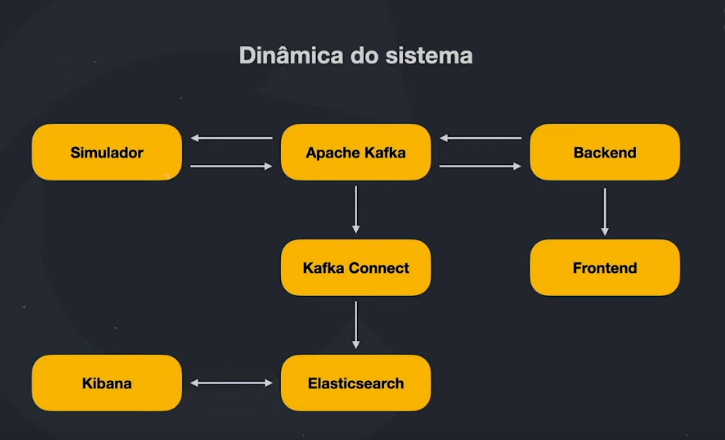

# Imersão FullStack & FullCycle 2

## Dinâmica do sistema

## Tecnologias utilizadas:

- Simulador: GoLang

- BackEnd: Nest.js e MongoDB

- FrontEnd: React.js

- Kafka e Kafka Connect

- ElasticSearch e Kibana

- Docker e Kubernetes

- Istio, Kiali, Prometheus e Grafana

## Kafka

1. Event-Driven

  - Carros
  - E-commerce
  - Alarmes
  - Monitoramento
  - Microsserviços

2. Tempo Real

3. Histórico de dados

4. Características

  - Plataforma
  - Trabalha de forma distribuída
  - Banco de dados
  - Extremamente rápido e com baixa latência
  - Utiliza o disco ao invés da memória para armazenar os dados
  - Não é apenas um sistema tradicional de filas como o RabbitMQ, Amazon SQS

5. Topic

  - Stream de dados que atua como um banco de dados
  - Todos os dados ficam armazenados, cada Topic tem seu "local" de armazenamento
  - Topic possui diversas partições
  - cada partição é definida por um número
  - é obrigado definir a quantidade de partições quando for criar um Topic
  - Producer e Consumer(s)

6. Cluster Kafka

  - Conjunto de Brokers
  
  - Cada Broker é um servidor
  
  - Cada Broker é responsável por armazenar os dados de uma partição
  
  - Cada partição de Topic está distribuído em diferentes 
  
  

  - Replication factory

  

  - Usa Zookeeper como service discover
  
  - Consumer Groups

  

7. Ecossistema

  - Kafka Connect: Conecta sistemas ex: banco de dados, APIs, etc
  - Confluent Schema Registry: Formato da mensagem
  - Rest Proxy: API Rest
  - ksqlDB: Como se fosse o SQL do kafka por exemplo usar comandos para fazer agregações
  - Streams: Para poder manipular os dados em mais baixo nível

## Links para os projetos

Imersão:

- [Simulator](./simulator/README.md)

Esquenta: 

- [Arquitetura Limpa com Typescript](https://github.com/rodolfoHOk/fullcycle.typescrit-clean-arch)

- [React Maps](https://github.com/rodolfoHOk/fullcycle.react-maps)

- [Go Iniciando do Zero](https://github.com/rodolfoHOk/fullcycle.go-init-from-zero)
